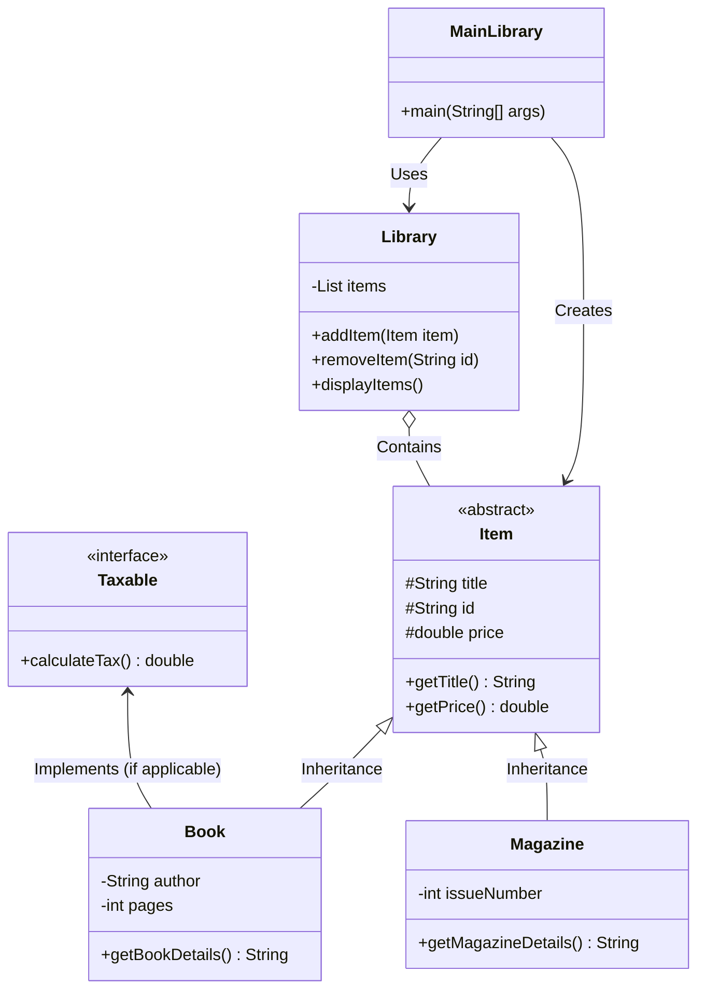

# 📚 Library Management System (Java)

A robust and object-oriented **Library Management System** implemented in Java. This project demonstrates core Object-Oriented Programming (OOP) principles such as inheritance, polymorphism, interfaces, and encapsulation to manage various library items like books and magazines efficiently.

---

## Features

- **Object-Oriented Design**: Utilizes an abstract base class (`Item`) and interfaces (`Taxable`) to structure library assets cleanly.
- **Polymorphism & Inheritance**: Manages specialized item types like `Book` and `Magazine` through a unified `Library` container.
- **Tax Calculation Support**: Implements the `Taxable` interface for items that require tax processing.
- **Interactive Execution**: Driven via `MainLibrary.java` to demonstrate adding, listing, and managing library resources.

---

## 🛠️ Project Structure

The project follows a clean, modular layout:

```text
Project Library Management System By Java/
│
├── Item.java          # Abstract base class representing generic library items
├── Book.java          # Subclass representing books (inherits from Item)
├── Magazine.java      # Subclass representing magazines (inherits from Item)
├── Taxable.java       # Interface for items subject to taxation
├── Library.java       # Core manager class handling collections of items
├── MainLibrary.java   # Entry point with the main method for testing and execution
└── README.md          # Project documentation
```
---



---

## 🧩 Class Architecture & Design
Item.java (Abstract Class):

Serves as the blueprint for all library materials.

Encapsulates common attributes such as title, ID, and price/cost.

Book.java & Magazine.java (Subclasses):

Extend Item to implement specific attributes and behaviors unique to books and magazines.

Taxable.java (Interface):

Defines tax-related methods implemented by applicable items to handle financial calculations.

Library.java:

Manages the inventory, allowing items to be added, searched, or displayed.

MainLibrary.java:

Contains the main method to run the application, instantiate objects, and simulate library operations.

## ⚙️ Getting Started & Installation
Prerequisites
Java Development Kit (JDK 8 or higher) installed on your machine.

Any Java IDE (such as IntelliJ IDEA, Eclipse, or NetBeans) or a terminal with javac/java.

## Running the Project
1. Navigate to the project directory:

Bash
```
cd "Project Library Management System By Java"
```
2. Compile all Java source files:

Bash
```
javac *.java
```
3. Run the application:

Bash
```
java MainLibrary
```
## 🤝 Contributing
Contributions, issues, and feature requests are welcome!

## 📝 License
This project is open-source and available under the MIT License.
